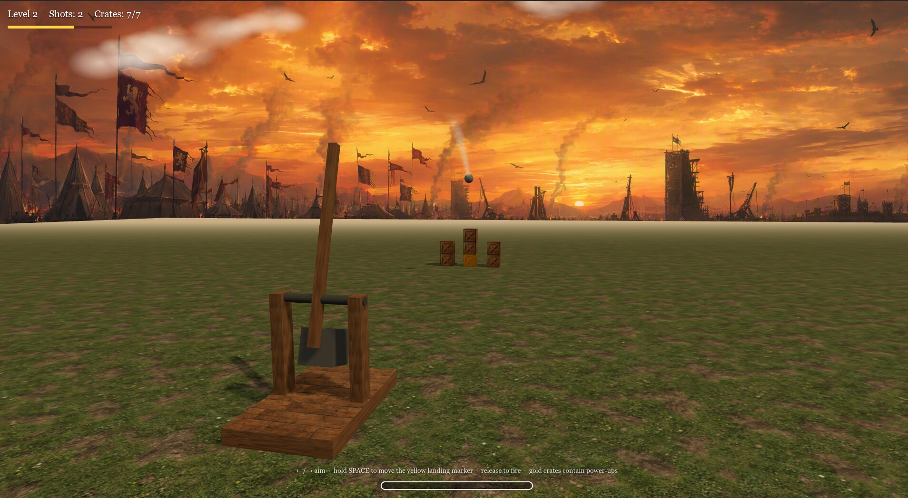

# 🏰 Castle Crasher

Lay siege with a trebuchet. Knock down every crate. Feel like a medieval
artillery genius (results may vary).

Castle Crasher is a cozy physics game about flinging boulders at crate
castles. Aim, charge, release — then watch the wreckage settle while smoke
drifts, the camera shudders, and your last crate falls in glorious slow
motion. It's harder than it looks. That's part of the charm.



## How to play

| Do this | To |
|---|---|
| **← / →** | Swing your aim left and right |
| **Hold SPACE** | Charge the throw — watch the yellow ring slide downrange |
| **Release SPACE** | Let it fly |
| **ENTER** | Continue after a victory (or a humbling defeat) |
| **Hold H** | Scout the crates — red are down, green still stand |
| **ESC** | Pause menu: music & sfx volume, or start over |

Botched your first shot? **ESC + ENTER** starts the game over instantly —
no judgment.

The yellow ring on the grass shows exactly where your shot will land.
Trust the ring. The ring is wise.

Knock every crate off its perch before you run out of shots. Red crates
are down; green ones are still laughing at you.

## Gold crates

Shiny gold crates hide power-ups. Topple one and the next shot (or your
ammo pouch) gets an upgrade:

- **+1 Shot** — one more boulder in the bag
- **Blast** — the ball explodes on impact. Deeply satisfying.
- **Heavy** — a cannonball with commitment issues: it does not bounce, it
  *arrives*
- **Multi** — three smaller balls in a fan. Shotgun rules.
- **Bouncy** — a cyan menace that careens through the whole castle

Power-ups stack. Yes, Blast + Multi means three explosions.

## Ten levels of escalating rudeness

A lone tower, triplet towers, a pyramid, a walled compound, a castle
gate — and that's just the warm-up. Beyond lie twin keeps, a staircase
fortress, a guarded courtyard, a great wall, and the citadel itself.
Clear a level and you carry **one bonus shot** into the next. Clear them
all and the castle is yours.

## Make it yours

- **Music** — drop your own `.mp3` / `.ogg` / `.wav` / `.m4a` files into
  `src/music/` and the game plays them as a shuffled soundtrack.
- **Backgrounds** — add images to `src/backgrounds/` and one is chosen at
  random each game. Tip: compose them with the horizon in the lower third
  of the frame — the game pins that line to its own horizon.

## Run it locally

```bash
npm install
npm run dev
```

Then open the printed local URL and start flinging.

---

Built with three.js and cannon-es. All sound effects are synthesized in
the browser — there isn't a single audio file in the code.
